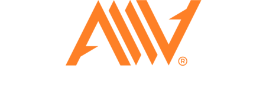

<p align="center">
      
</p>

---

<h2 align="center">"Formação Fullstack Developer B7 Web - Projeto Awax". 🥳</h1>

---

<h2 align="center">Sobre 📖</h2>
   
   <p align="center">
      O projeto Awax, desenvolvido na Formação Fullstack Developer da <a href="https://b7web.com.br/fullstack/">B7 Web</a><br>
      O projeto tem como inspiração uma o layout de uma agência de publicidade e tem como intenção praticar as habilidades repassadas durante o curso. 😀<br>
   </p>
   
- O que foi aprendido com este projeto:

- ✅ "Mobile First" 💪
- ✅ "Flexbox Layout" 👀
- ✅ "Responsividade" 📌
- ✅ "Posicionamentos" 🔥
- ✅ "Animações CSS" 🚀

---

<h2 align="center">Preview 🖥️</h2>

   <p align="center">
      
   </p>

   > * Veja o projeto em funcionamento [`aqui`](https://project-agencymkt.netlify.app). 🧐

---

<h2 align="center">Tecnologias 🚀</h2>

- [HTML](https://html.com/)
- [CSS](https://developer.mozilla.org/pt-BR/docs/Web/CSS)
- [SASS/SCSS](https://www.sqlite.org/index.html)
- [JavaScript](https://www.javascript.com/)

---

<h2 align="center">Como usar 🤔</h2>

```
- Clone o repositório:
  $ git clone https://github.com/michaelsribeiro/projetoAwax-website.git

- Entre no diretório:
  $ cd Awax

- Open your browser in:
  http://localhost:5500/  
```


<h2 align="center">Licença 📝</h2>

<p align="center">
   Este repositório está sob licença MIT. Você pode ver o arquivo <a href="https://github.com/michaelsribeiro/projetoAwax-website/blob/main/LICENSE.md"> LICENSE </a> para mais detalhes. 😉
</p>
